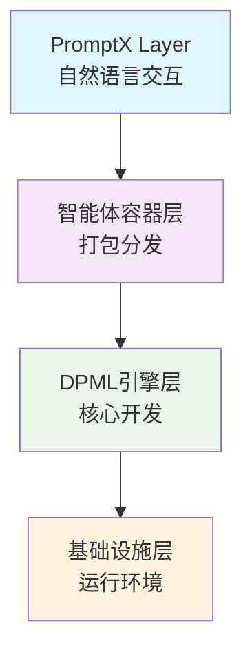
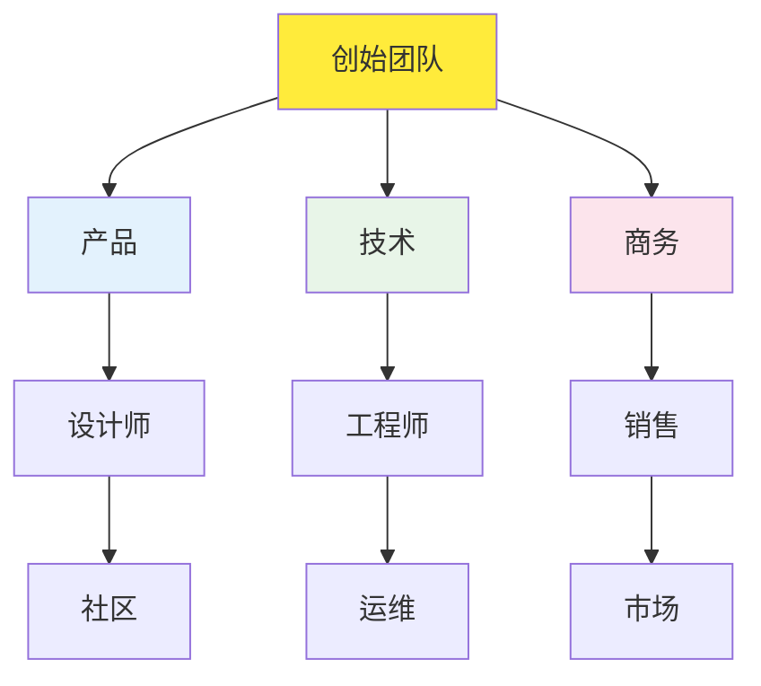

# 深度实践 Deepractice.ai 商业计划书

> 🚀 **AI时代的基础设施标准制定者**

## 📋 快速导航

- [📊 执行摘要](#executive-summary--执行摘要)
- [🔍 问题与解决方案](#1-problem--solution--问题与解决方案)
- [📈 市场分析](#2-market-analysis--市场分析)
- [💰 商业模式](#3-business-model--商业模式)
- [🛠 产品与技术](#4-product--technology--产品与技术)
- [🚀 市场策略](#5-go-to-market--市场策略)
- [👥 团队介绍](#6-team--团队介绍)
- [📊 财务预测](#7-financial-projections--财务预测)
- [💼 融资需求](#8-funding--use-of-funds--融资需求)
- [⚠️ 风险分析](#9-risk-analysis--风险分析)
- [📎 附录](#appendix--附录)

---

## Executive Summary | 执行摘要

### 一句话描述
**AI时代的标准制定者** - 让智能体开发像搭积木一样易用，像容器一样标准化，实现AI触手可及

### 核心价值主张
- **开发简单**：以10个标签语法替代100行Python代码构建专业智能体，无需深入理解模型原理，大模型仅作为载体
  > 我们认为人工智能是高于传统软件或计算机的智能化，特定行业逻辑的沉淀不再是代码而是提示词。  
  > 项目实绩: [DPML · 声明式标签AI应用开发协议](https://github.com/Deepractice/DPML)

- **共享便捷**：一次定义，随处执行 (Define once, Execute anywhere)。智能体打包分发如Docker容器，一键部署
  > 我们遵循结果导向，交付专业智能体使其具唯一性和具象化特征，融合装机即用目标实现便携封装和打包服务。

- **使用自然**：对话即一切（Chat is all you need）。零学习成本的AI交互重新设计传统人机协作模式
  > 我们坚信AI时代的信息交互模式，应脱离传统互联网软件方式，以自然语言交互为基础。  
  > 项目实绩: [PromptX · 领先的上下文工程平台](https://github.com/Deepractice/PromptX)

### 牵引力数据
- 开源2个月内 GitHub Star 1.8K+、Forks 100+
- 月增长率`900` Stars，日活跃增长`30` Stars
- 生态覆盖：支持多个主流AI客户端

### 关键数据
- 目标市场：AI应用基础设施，预计2027年达到$200亿
- 融资需求：$200万（Seed轮），用于18个月产品开发和市场拓展
- 投后估值：$2,000万-2,500万

---

<details>
<summary><h2>1. Problem & Solution | 问题与解决方案</h2></summary>

### 🔴 核心问题
**AI应用开发门槛过高，缺乏标准化基础设施**

1. **开发复杂**：通用AGI使用成本高、缺乏唯一性，而构建专业智能体需要深度行业经验或技术背景，开发周期长
2. **分享困难**：智能体无法标准化打包，难以复用和分发，仅交付提示词不足以达成目标，需要结果导向
3. **使用门槛**：传统软件交互模式在AI时代需要被重新定义，像日常说话一样自然

### 💡 解决方案
**三层架构重新定义AI应用基础设施**

#### Layer 1: DPML协议层
- **领域专用语言(Domain-Specific Language, DSL)**：声明式标签语言覆盖90%智能体开发需求
- **自然语言编程**：业务逻辑用自然语言描述，将通用和不变的需求以高效率特征的代码形式固化于底层
- **快速迭代**：区别于传统复杂编程，让任何人均可轻松定制和部署智能体

#### Layer 2: 智能体共享生态
- **一键分发**：智能体如应用商店般便捷分享，让专业能力触手可及
- **协同工作**：多个智能体协作完成复杂任务，实现1+1>2的效果
- **生态协作**：开发者共建智能体交易市场，用户按需获取专业服务

#### Layer 3: 自然语言交互
- **PromptX框架**：统一的对话式交互标准
- **无界面设计**：用户通过自然语言完成所有操作
- **AI-First UX**：为AI时代重新设计的用户体验

</details>

---

<details>
<summary><h2>2. Market Analysis | 市场分析</h2></summary>

## 驱动逻辑差异
 - AI + 行业 = 由AI主导行业升级的技术驱动和价值观优先
 - 行业 + AI = 业务主导的工具思维和降本增效

## 未来预测：轻技术、重服务的AI时代
 - 趋势1：技术门槛降低，产品运营能力成为核心竞争力
 - 趋势2：AI行业将独立存在，解决使用AI产生的新问题

### 市场规模 (TAM/SAM/SOM)

#### TAM (Total Addressable Market): $200亿（2027年）
- 基于Gartner权威预测，全球AI软件市场于2030年达到$1,850亿
- AI开发应用工具约占市场10-15%(相当于$185-280亿)
- 参考Docker容器化市场，从0到数十亿美元的发展轨迹
- AI应用开发标准化需要3-4年成熟期，2027年是技术采用的拐点

#### SAM (Serviceable Addressable Market): $40亿
- 基于IDC数据，企业级开发工具市场年复合增长率22%
- AI开发工具细分：包括MLOps平台、AI开发框架、智能体开发工具
- 对标GitHub Copilot、Hugging Face等成功案例的市场表现
- 保守估计占TAM的20%（$200亿×20%=$40亿）

#### SOM (Serviceable Obtainable Market): $5亿
- 目标细分：AI原生工业级软件基础设施（容器化+标准化）
- 市场渗透策略：
  * 2025-2026：跨业态社区（占SOM的10%）
  * 2027-2028：中小企业客户（占SOM的30%）
  * 2029-2030：大企业客户（占SOM的60%）
- 对标Docker容器化革命：我们要成为AI时代的基础设施标准，5年内实现$5亿ARR，10年内估值$50亿+
- 竞争优势：开源社区网络效应、标准制定及生态锁定的三重护城河
  * 先发优势 ：AI标准化的时间窗口期优势
  * 技术壁垒 ：DPML标签语言的核心价值和生态锁定
  * 资本效率 ：开源模式下的低成本流量获取

### 目标客户

#### 主要客户群体
1. **企业开发团队** (60%)
   - 中大型企业的AI转型需求
   - 传统软件公司的AI化升级
   > 生产端优势直接创造价值：效率=金钱（对比消费端免费产品积压付费空间的困境）

2. **AI创业公司** (25%)
   - 快速原型验证需求
   - 降低技术门槛和开发成本
   > 创业者友好：轻资源启动，ROI可量化（如编程、内容处理场景）

3. **领域工作者** (15%)
   - 垂直领域（医疗、法律、金融、教育等）
   - 智能体创作者内容经济
   > 社会刚需：生产历史技术革命的核心（蒸汽机 ➞ 互联网 ➞ 人工智能）

#### 客户痛点验证
- **调研数据**：当前中国市场作为基本盘，社区已积累1K+精准用户群体对比10K+泛化用户更有价值
- **市场反馈**：领先的上下文平台`PromptX`开源项目GitHub于2025年Q3起已获得1.8K+ Stars

### 竞争分析

| 竞争类型 | 优势 | 劣势 | 差异化 |
|---------|------|------|--------|
| 国际开源AI框架 | 生态丰富，社区活跃 | 学习曲线陡峭，开发复杂 | 我们提供标签语法简化开发 |
| AI Agent平台 | 知名度高，功能完整 | 缺乏标准化，难以复用 | 我们有容器化基础设施 |
| 大厂AI平台 | 资源充足，技术先进 | 封闭生态（vendor lock-in） | 我们开源开放，标准制定 |

</details>

---

<details>
<summary><h2>3. Business Model | 商业模式</h2></summary>

### 核心策略：开源+服务
**参考成功案例：Docker, PingCAP, MongoDB**

#### 开源部分 (流量获取)
- **核心引擎**：完全开源，建立技术标准
- **基础工具**：开发、调试、部署的基础功能
- **社区版本**：满足个人和小团队需求

#### 商业化服务 (收入来源)

1. **企业版订阅** ($XXX/月/团队)
   - 高级功能：企业级安全、权限管理、审计
   - 技术支持：7x24小时专业服务
   - SLA保障：99.9%可用性承诺

2. **云服务平台** (按使用量计费)
   - 智能体托管：$X/智能体/月
   - API调用：$X/千次调用
   - 存储和计算：按需付费

3. **专业服务** ($XXX/项目)
   - 定制开发：企业专属智能体
   - 咨询培训：AI转型咨询
   - 技术集成：现有系统集成

4. **生态分成** (10-30%分成)
   - 智能体市场：开发者分发平台
   - 合作伙伴：渠道和集成商

*我们的商业模式是开源，低成本获取流量及用户，验证市场需求，对比商业化宣发推广成本，以技术换取比流量*
*围绕AI生态，搭建技术标准协议、社区、人脉、智能体/软件平台 - 产品力及影响力*
*服务面，提供技术服务，流量服务，内容服务，大模型或token代理服务，以及智能体应用市场*
*核心开源，服务收费 - 互联网时代的造工具，拓展为平台的模式*

### 收入预测

| 年份 | 用户数 | 付费转化率 | 年收入 | 主要驱动因素 |
|------|--------|------------|--------|--------------|
| 2026 | 1万 | 5% | $50万 | 产品验证 |
| 2027 | 10万 | 8% | $500万 | 市场拓展 |
| 2028 | 50万 | 12% | $3000万 | 规模化 |
| 2029 | 100万 | 15% | $8000万 | 生态成熟 |

</details>

---

<details>
<summary><h2>4. Product & Technology | 产品与技术</h2></summary>

### 技术架构



### 核心技术优势

1. **DPML语言设计**
   - 几个核心标签覆盖主要场景
   - 声明式语法，学习成本低
   - 强类型系统，减少运行时错误

2. **智能体容器化**
   - 轻量级打包，启动速度快
   - 依赖隔离，避免版本冲突
   - 跨平台兼容，一次构建到处运行

3. **自然语言编译器**
   - 提示词到执行代码的自动转换
   - 语义理解和意图识别
   - 动态优化和性能调优

### 技术护城河

- **标准制定者优势**：DPML成为行业标准的先发优势
- **网络效应**：智能体数量越多，平台价值越大
- **数据飞轮**：使用数据改进AI模型，提升用户体验

</details>

---

<details>
<summary><h2>5. Go-to-Market | 市场策略</h2></summary>

### 三阶段市场策略

#### Phase 1: 开发者社区 (0-12个月)
**目标：建立技术影响力，验证产品市场契合度**

- **开源发布**：GitHub开源，技术博客，会议演讲
- **社区建设**：以中国市场作为基本盘，建立多个微信交流群，汇聚各行业专业人士交流
- **KOL合作**：与AI领域意见领袖合作推广
- **成功指标**：1万GitHub Star，1000活跃贡献者

#### Phase 2: 企业客户 (12-24个月)
**目标：商业化验证，建立付费用户基础**

- **标杆客户**：重点服务至少10家标杆企业
- **案例营销**：成功案例分享，ROI数据展示
- **渠道合作**：与系统集成商、大模型供应商或咨询公司合作
- **成功指标**：100家付费企业，$500万ARR

#### Phase 3: 平台生态 (24个月+)
**目标：建立生态系统，实现规模化增长**

- **生态建设**：智能体市场，开发者激励计划
- **国际视野**：海外市场拓展，多语言支持
- **战略合作**：与云厂商、大模型公司深度合作
- **成功指标**：平台GMV过亿，生态开发者过万

### 销售策略

1. **产品驱动增长 (PLG)**
   - 免费试用降低门槛
   - 产品内引导付费转化
   - 用户成功团队保障留存

2. **企业直销**
   - 专业销售团队
   - 技术售前支持
   - 大客户定制服务

3. **合作伙伴渠道**
   - 系统集成商合作
   - 云厂商联合销售
   - 咨询公司推荐

</details>

---

<details>
<summary><h2>6. Team | 团队介绍</h2></summary>

### 核心团队

#### 姜山 (创始人 & CEO)
- **背景**：sean.deepractice.ai
- **职责**：产品战略、技术架构、团队管理
- **优势**：连续创业者，具备深度AI行业见解和实践支撑

#### 周明轩 (联合创始人)
- **背景**：多年线上教培和软件开发项目经历
- **职责**：技术落地、社群运营、内容管理
- **优势**：擅长将复杂技术转化为易用产品，具备丰富的内容创作和社区运营经验

#### 杨清禾 (联合创始人)
- **背景**：曾于头部互联网企业任职，拥有跨行业实践经历，具备产品和技术背景
- **职责**：商业合作、市场拓展、运营实施
- **优势**：头部互联网企业产品和技术背景、跨地区机动性

### 团队优势

*分布式办公结构，共同围绕一个深度实践品牌，每个成员都有自己的产品力及影响力*

1. **技术实力**
   - 核心团队具备深厚AI实操及落地经验
   - 对智能体及行业结合有深度理解
   - 快速迭代和产品化能力强

2. **市场敏感度**
   - 把握AI先发优势
   - 快速验证市场需求
   - 开源社区运营经验

3. **执行力**
   - 精益团队，决策效率高
   - 每个成员都是特定领域专家
   - 通过AI放大个人能力

### 组织架构



### 人才招聘计划

- **2025年**：组建核心成员10+人
- **2026年**：拓展销售团队5人，市场团队3人
- **2027年**：国际化，生态合作团队

</details>

---

<details>
<summary><h2>7. Financial Projections | 财务预测</h2></summary>

### 收入模型

#### 订阅收入 (SaaS)
- **企业版**：$299/月/团队 (10人)
- **专业版**：$99/月/团队 (5人)
- **个人版**：$29/月/用户

#### 使用量收入 (Usage-based)
- **API调用**：$0.01/千次
- **智能体托管**：$10/智能体/月
- **存储费用**：$0.1/GB/月

#### 服务收入 (Professional Services)
- **实施服务**：$1000-5000/项目
- **培训咨询**：$500/人/天
- **定制开发**：$10万-50万/项目

### 三年财务预测

| 项目 | 2026年 | 2027年 | 2028年 |
|------|--------|--------|---------|
| **收入** |
| 订阅收入 | $30万 | $300万 | $1500万 |
| 使用量收入 | $10万 | $100万 | $800万 |
| 服务收入 | $10万 | $100万 | $500万 |
| **总收入** | $50万 | $500万 | $2800万 |
| **成本** |
| 人力成本 | $40万 | $200万 | $800万 |
| 基础设施 | $5万 | $50万 | $200万 |
| 市场营销 | $10万 | $100万 | $400万 |
| **总成本** | $55万 | $350万 | $1400万 |
| **净利润** | -$5万 | $150万 | $1400万 |
| **现金流** | -$5万 | $145万 | $1545万 |

### 关键指标 (KPIs)

| 指标 | 2026年 | 2027年 | 2028年 |
|------|--------|--------|---------|
| 月活用户 (MAU) | 1万 | 10万 | 50万 |
| 付费用户 | 500 | 8000 | 6万 |
| 月经常性收入 (MRR) | $4万 | $40万 | $230万 |
| 客户获取成本 (CAC) | $100 | $80 | $60 |
| 客户生命周期价值 (LTV) | $1200 | $1500 | $2000 |
| LTV/CAC比率 | 12:1 | 19:1 | 33:1 |
| 月流失率 | 5% | 3% | 2% |

</details>

---

<details>
<summary><h2>8. Funding & Use of Funds | 融资需求</h2></summary>

### 融资概况
- **融资轮次**：Seed轮
- **融资金额**：$200万
- **出让股份**：8-10%
- **投前估值**：$1,800万-2,300万
- **投后估值**：$2,000万-2,500万
- **资金用途**：产品开发、团队扩张、市场拓展

### 资金使用计划

> 基于投人逻辑，每个人都是一个特定领域的存在（即各自的产品力及影响力）<br>
> 主导社区或产品的追随者和AI，透过AI干活及执行具体的事项 <br>
> 社区运营成本，贡献者激励机制、使用AI的成本类比传统招聘开发者 <br>
> 人力及算力一开始都有，但无法发挥，所以不是金钱越多越好，而是更好的把资源组织运用起来

#### 18个月资金使用分配

```
产品开发 (40% - $80万)
├── 核心工程师 x 4人 ($60万)
├── 产品设计师 x 1人 ($12万)
└── 技术基础设施 ($8万)

团队建设 (35% - $70万)
├── 销售团队 x 2人 ($30万)
├── 市场营销 x 2人 ($25万)
└── 运营支持 x 1人 ($15万)

市场拓展 (20% - $40万)
├── 品牌建设和PR ($15万)
├── 会议和活动 ($10万)
└── 广告投放 ($15万)

运营成本 (5% - $10万)
├── 办公租金 ($6万)
└── 法务财务 ($4万)
```

### 里程碑计划

#### 6个月里程碑
- [ ] DPML 1.0 正式发布
- [ ] 社区用户突破5000人
- [ ] 完成10个标杆客户签约
- [ ] 团队扩展到15人

#### 12个月里程碑
- [ ] 企业版产品上线
- [ ] 月收入达到$10万
- [ ] 智能体市场Beta版发布
- [ ] 完成A轮融资准备

#### 18个月里程碑
- [ ] 年收入突破$200万
- [ ] 国际化版本发布
- [ ] 生态合作伙伴超过50家
- [ ] 启动A轮融资

</details>

---

<details>
<summary><h2>9. Risk Analysis | 风险分析</h2></summary>

### 主要风险及应对策略

#### 技术风险
**风险**：大模型技术快速迭代，可能影响产品架构
**应对**：
- 保持技术架构的灵活性和可扩展性
- 与主流大模型厂商建立合作关系
- 持续跟踪前沿技术发展

#### 竞争风险
**风险**：大厂凭借资源优势快速跟进
**应对**：
- 建立开源社区护城河
- 专注细分领域，做深做透
- 快速迭代，保持技术领先

#### 市场风险
**风险**：AI应用市场发展不及预期
**应对**：
- 多元化客户群体，降低单一市场依赖
- 灵活调整产品策略
- 建立多样化收入来源

#### 团队风险
**风险**：核心人员流失，影响产品发展
**应对**：
- 建立完善的股权激励机制
- 营造良好的团队文化
- 知识文档化，降低人员依赖

#### 资金风险
**风险**：融资进度不及预期，影响发展节奏
**应对**：
- 控制成本，延长资金使用周期
- 多渠道融资，降低单一依赖
- 加快商业化进程，提升自我造血能力

*被大厂超越，大厂人多，但是只有执行力，而不是对市场的敏锐度和创意面*
*我们的软件开发速度不比大厂低*
*资源积累速度慢，包括人脉、资本、...，可能无法达成一开始说的目标*
*对接资本不是看重金钱，如果资本方背后拥有大量B端客户给我们服务，介绍客户和名气 - 影响力资源*

### 风险缓解措施

1. **技术多样化**：不依赖单一技术路线
2. **客户多元化**：覆盖不同行业和规模客户
3. **收入多样化**：订阅+使用量+服务多重收入
4. **团队激励**：股权+现金+成长机会
5. **财务管控**：严格预算管理，定期财务审查

</details>

---

<details>
<summary><h2>Appendix | 附录</h2></summary>

### 市场调研数据
- [具体调研报告]
- [客户访谈记录]
- [竞品分析详情]

### 财务模型
- [详细财务预测表]
- [敏感性分析]
- [估值模型]

### 法律文件
- [公司章程]
- [股权结构]
- [知识产权清单]

</details>

---

**联系方式**
- 邮箱：contact@deepractice.ai
- 官网：https://deepractice.ai
- GitHub：https://github.com/Deepractice

---

*本商业计划书包含前瞻性陈述，实际结果可能与预测存在差异。投资有风险，决策需谨慎。*
